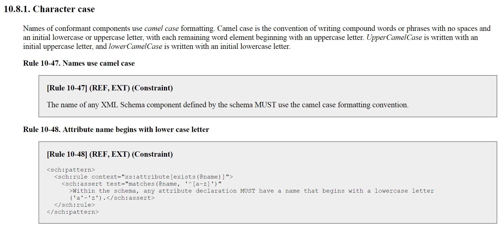

The **[NIEM Naming and Design Rules (NDR)]({{ site.data.links.ndr }})** describes the  architecture of the NIEM data model and its representation in XML.  It specifies principles and enforceable rules for NIEM data components and schemas.

{:.features}
- A description of the underlying NIEM data model
- Guiding principles behind the design of NIEM
- Rules for using XML Schema constructs in NIEM
- Rules for modeling and structuring NIEM-conformant schemas
- Rules for creating NIEM-conformant instances
- Rules for naming NIEM components
- Rules for extending NIEM-conformant components

These rules are intended to establish and, more importantly, enforce a degree of standardization across a broad set of users in order to improve precision and interoperability across the NIEM community.

<!--more-->

## NDR Conformance Targets

The NDR describes and defines rules for four different kinds of documents:




In addition to the list above, the NDR defines a **`Instance document`** - An XML instance that is valid to a [Schema document set](set/).

{:.note}
> The **[REF vs EXT](ref-vs-ext/)** page is a very handy guide to compare the differences between the two primary rule sets.

## Conformance Validation

While some rules in the NDR require subjective judgment (like determining if component names and definitions are semantically meaningful), other rules are capable of being automated.  Starting with NDR version 3.0, such rules have been written as Schematron rules.  Schematron is an ISO specification that describes a validation language for assertions about XML documents.

Schematron representations of NDR rules provide several key benefits.  There is a single, normative interpretation of each rule.  This eliminates the possibility that different users might read read a free-text rule description and apply it in different ways.

Schematron rules can also be used to validate XML documents.  This makes it *substantially* easier for users to test NIEM REF and EXT XML schemas against the NDR to see if those schemas conform to the given NDR conformance target.

{:.note}
> Two common ways to test NDR conformance are to use **[ConTesA]({{ site.data.pages.contesa | relative_url }})** or to use **[Schematron validation](oxygen-schematron/)** within Oxygen XML Editor.

## Rules

Refer to the **[NDR]({{ site.data.links.ndr }})** for the full set of rules.  Descriptions, principles, and/or examples often accompany each rule.  The NDR Table of Contents and the rules index in the Appendix can be used to jump directly to particular topics.

See the `Modeling` and `XML` sub-pages in the [Concepts section]({{ "/reference/concepts/" | relative_url }}) to a collection of rules relating to particular topics.  For example, the [Namespaces XML page]({{ "/reference/concepts/namespace/xml/" | relative_url }}) contains a list of NDR rules related to a namespace and its representation in NIEM XML (a XML schema).

### Example Rule

The image below shows a small excerpt from the NDR.

{:.note}
- Each rule shows which conformance targets they apply to.  In these cases, both rules apply to both REF and EXT schemas because they are labeled as `(REF, EXT)`
- `Rule 10-47` is a descriptive, free-text rule.  Conformance for this rule must be checked manually.
- `Rule 10-48` is written in Schematron and can be tested via [ConTesA]({{ site.data.pages.contesa | relative_url }}) or [Oxygen](oxygen-schematron/).

{:.bordered}

